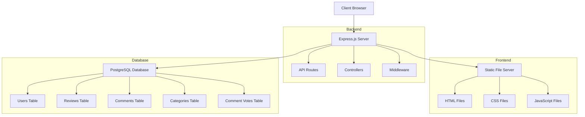
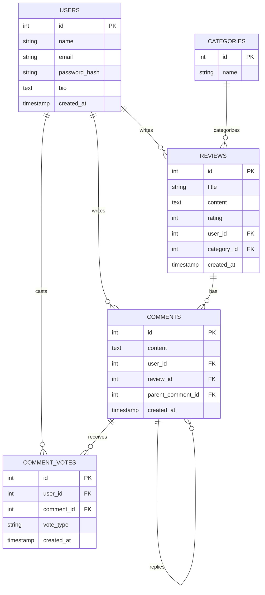

# Review Hub - System Architecture

## High-Level Architecture



## Component Details

### Frontend Components

1. **HTML Pages**:
   - `index.html`: Home page with search and featured reviews
   - `categories.html`: Browse reviews by category
   - `write-review.html`: Form for creating new reviews
   - `profile.html`: User profile and review history
   - `review.html`: Detailed view of a single review
   - `about.html`: Company information

2. **CSS Modules**:
   - `styles.css`: Global styles and base components
   - Page-specific styles for each HTML page

3. **JavaScript Modules**:
   - `main.js`: Core functionality and utilities
   - Page-specific JavaScript for interactive features

### Backend Components

1. **Server**:
   - `server.js`: Main entry point and Express app configuration

2. **Middleware**:
   - Authentication middleware for protected routes
   - CORS configuration
   - JSON body parsing

3. **Routes**:
   - User routes (registration, login, profile)
   - Review routes (create, read, comment)

4. **Controllers**:
   - User controller (registration, login, profile management)
   - Review controller (review and comment operations)

5. **Database**:
   - Connection management
   - Query execution

### Database Schema



## Data Flow

1. **User Registration/Login**:
   ```
   Client → /api/users/register → UserController → Database → JWT Token → Client
   Client → /api/users/login → UserController → Database → JWT Token → Client
   ```

2. **Review Creation**:
   ```
   Client → /api/reviews (with JWT) → ReviewController → Database → Response → Client
   ```

3. **Review Retrieval**:
   ```
   Client → /api/reviews → ReviewController → Database → Response → Client
   ```

4. **Comment Addition**:
   ```
   Client → /api/reviews/:id/comments (with JWT) → ReviewController → Database → Response → Client
   ```

## Security Considerations

1. **Authentication**:
   - JWT tokens for session management
   - Password hashing with bcrypt
   - Protected routes with middleware

2. **Data Validation**:
   - Server-side validation of all inputs
   - SQL injection prevention through parameterized queries

3. **CORS**:
   - Configured CORS policies for API access

This architecture provides a solid foundation for a scalable review platform with clear separation of concerns between frontend and backend components.